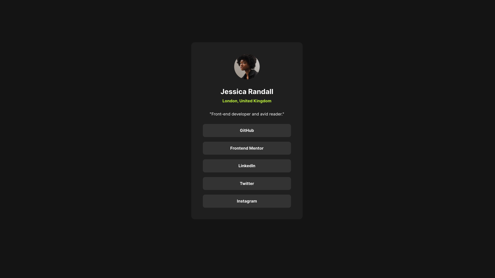
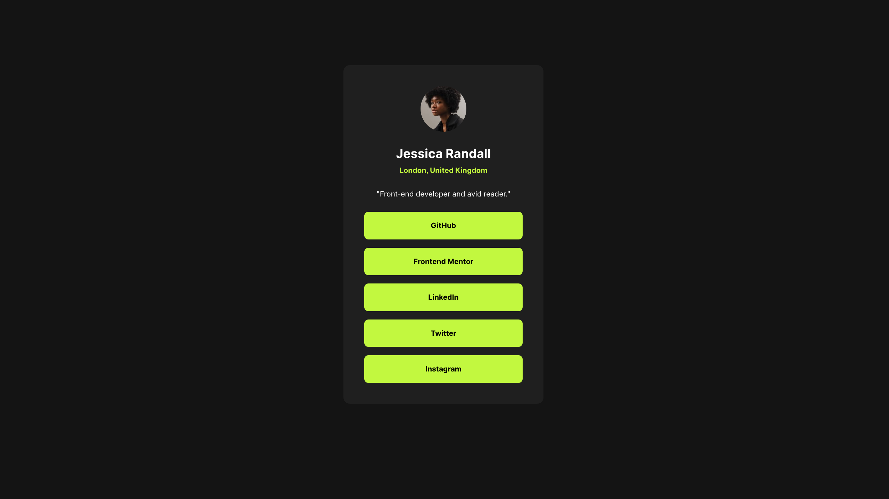

# 🌐 Social links profile

This is my take on the Frontend Mentor – [Social links profile challenge!](https://www.youtube.com/watch?v=dq0xZl66FTM)

## ✨ Preview

## 🛠️ Built With

- HTML5
- CSS3 and SCSS
- Google Fonts (Inter)

---

## 📌 Why I Self-Host Fonts

I chose to download the fonts and serve them locally rather than loading them from Google Fonts (or nay external CDN). This approach avoids sending visitor data—such as IP addresses—to third-party servers when the website loads the font files.

In 2022, a German court ruled that embedding Google Fonts via external requests could violate privacy laws (such as GDPR) because user IP addresses are automatically transmitted. While this mainly affects sites serving users in the EU, self-hosting fonts ensures full control over how assets are delivered and avoids any potential privacy or legal issues.

[German Court Rules Websites Embedding Google Fonts Violates GDPR](https://thehackernews.com/2022/01/german-court-rules-websites-embedding.html)

### Benefits of Self-Hosting Fonts

- Better privacy: No external requests → no IP address sharing.
- More control: Fonts are part of your project assets.
- Better performance: Files can be cached with your site instead of loading from a remote CDN.
- Avoids legal trouble: Complies with privacy expectations in stricter regions.

---

## 🔗 Links

- Frontend Mentor Challenge - [Social links profile challenge](https://www.frontendmentor.io/challenges/social-links-profile-UG32l9m6dQ)

- GitHub Repo - [Social links profile github repo](https://github.com/CodedByLu/frontend-mentor-challenges/tree/main/social-links-profile)

- Live Site - [Social links profile live site](https://codedbylu.github.io/frontend-mentor-challenges/social-links-profile/)

---

## ❤️ Author

Connect with me:

- GitHub - [https://github.com/CodedByLu](https://github.com/CodedByLu)

- Youtube - [http://www.youtube.com/@codedbylu](http://www.youtube.com/@codedbylu)

---

## 💛 Acknowledgment

Thanks to Frontend Mentor for the challenge -- this challenge was a lot of fun to tackle! 🎉
